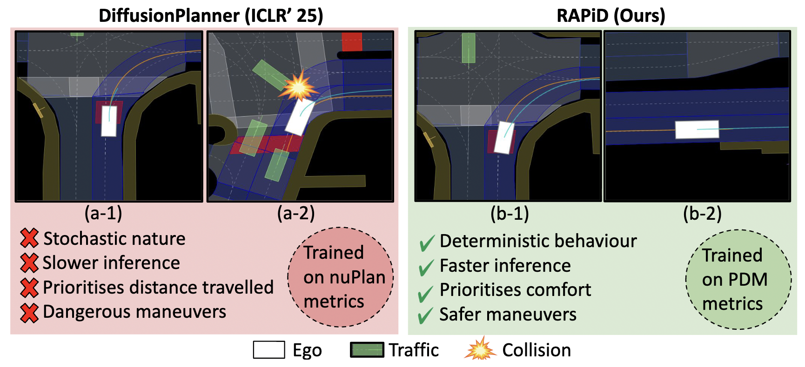

# We will release the pretrained models soon!!

# RAPiD: Real-time Deterministic Trajectory Planning via Diffusion Behavior Priors for Safe and Efficient Autonomous Driving

The official repository of the paper with supplementary: [RAPiD]()

## About the project

This project is a collaboration between [Monash University, Malaysia campus](https://www.monash.edu.my/) and [Data Science & AI Lab](https://www.monash.edu/it/dsai) in the [Faculty of Information Technology](https://www.monash.edu/it), [Monash University, Melbourne (Clayton), Australia](https://www.monash.edu/).

Project Members -

[Ruturaj Reddy](https://scholar.google.com/citations?user=L31atXwAAAAJ&hl=en) [(Monash University, Melbourne, Australia)](https://www.monash.edu/),                                                                                                                                                     
[Hrishav Bakul Barua](https://www.researchgate.net/profile/Hrishav-Barua)  [(Monash University and TCS Research, Kolkata, India)](https://www.tcs.com/what-we-do/research),  
[Loo Junn Yong](https://research.monash.edu/en/persons/loo-junn-yong/) [(Monash University, Malaysia)](https://www.monash.edu.my/),
[Thanh Thi Nguyen](https://sites.google.com/view/thanh-thi-nguyen) [(Monash University, Melbourne, Australia)](https://www.monash.edu/),
[Ganesh Krishnasami](https://research.monash.edu/en/persons/ganesh-krishnasamy) [(Monash University, Malaysia)](https://www.monash.edu.my/).
